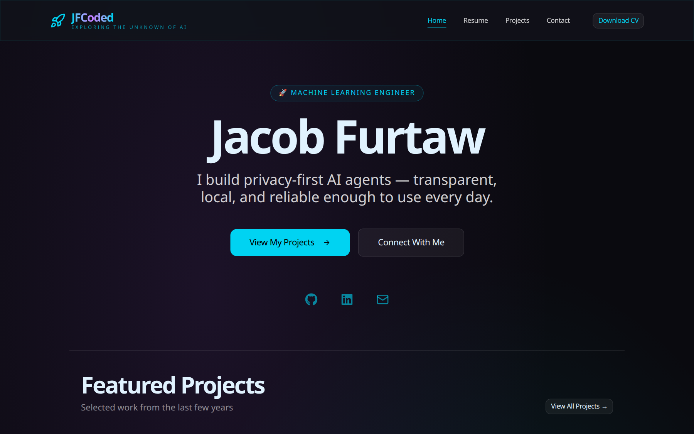

# JFCoded

Personal portfolio and virtual resume — **Jacob Furtaw**, Machine Learning Engineer.



[jfcoded.com](https://www.jfcoded.com) · [GitHub](https://github.com/JakeFurtaw) · [LinkedIn](https://www.linkedin.com/in/jacob-furtaw)

## What's in here
- **Home** — hero + featured projects
- **Projects** — filterable grid with a project timeline, detail modals, and an image lightbox
- **Resume** — experience, education, skills + full CV (PDF)
- **Contact** — socials and contact info

## Stack
Next.js 16 (App Router) · React 19 · TypeScript (strict) · Tailwind CSS v4 · shadcn/ui · Framer Motion
Deployed on Vercel.

## Getting Started
```bash
npm install        # first time only
npm run dev        # http://localhost:3000
npm run build      # typecheck + production build
npm run lint       # ESLint (flat config)
```

## Structure
- `app/` — routes (home, projects, resume, contact)
- `lib/projects.ts` — single source of truth for project data; `featuredProjectIds` controls the homepage
- `components/ui/` — shadcn/ui base + custom components (Navbar, Footer, ProjectTimeline, …)
- `public/projectImages/` — project screenshots

See `AGENTS.md` for working agreements (plan before editing, copy rules, no pushing without asking).
